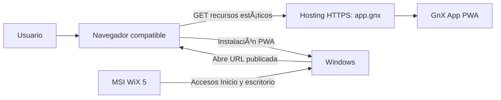
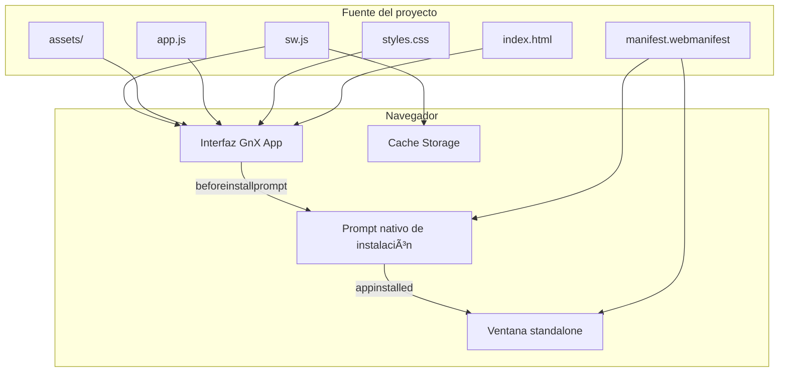
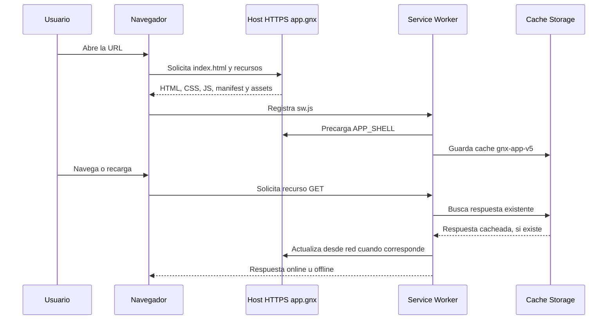
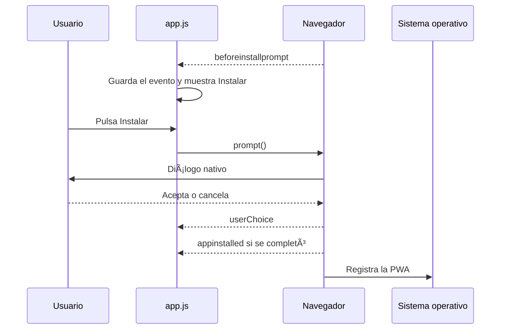
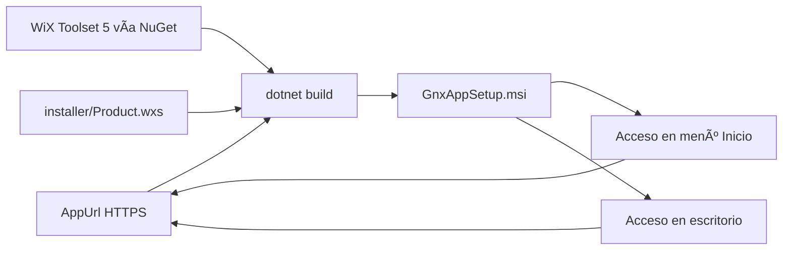

# Arquitectura de GnX App

## 1. Alcance actual

GnX App es una aplicación web estática instalable como PWA. La versión actual no tiene backend, base de datos ni servicios de aplicación: entrega una interfaz local, registra un Service Worker y permite la instalación nativa cuando el navegador la ofrece.

La distribución Windows se realiza mediante un instalador WiX Toolset 5 que crea accesos directos a una URL HTTPS publicada. El instalador no contiene un servidor ni convierte la PWA en una aplicación nativa.

## 2. Contexto del sistema



## 3. Componentes



## 4. Flujo de ejecución y offline



El Service Worker aplica estas políticas:

- Instalación: precache del shell y los iconos del manifest.
- Navegación: red primero; si falla, sirve `index.html` desde caché.
- Recursos GET: devuelve caché inmediatamente y actualiza desde red.
- Activación: elimina versiones antiguas `gnx-app-*`.
- Peticiones externas o métodos distintos de `GET`: quedan fuera del Service Worker.

## 5. Instalación PWA



La página no crea accesos directos de Windows directamente. La ubicación final —Inicio, escritorio o barra de tareas— depende del navegador y de la acción del usuario.

## 6. Distribución Windows con WiX 5



Características actuales del MSI:

- Instalación por usuario (`Scope=perUser`).
- URL configurable mediante `AppUrl`.
- Acceso en el menú Inicio.
- Acceso en el escritorio.
- Desinstalación de entradas y carpetas administradas.
- No instala runtime, servidor, navegador ni backend.
- No fija automáticamente la aplicación en la barra de tareas.
- El MSI generado localmente no está firmado digitalmente.

Comando de compilación:

```powershell
dotnet build installer\GnxApp.wixproj -p:AppUrl=https://app.gnx
```

## 7. Mapa de archivos

| Ruta | Responsabilidad |
|---|---|
| `index.html` | Estructura y controles de la interfaz |
| `styles.css` | Presentación visual y estados de foco |
| `app.js` | Instalación PWA real y mensajes de estado |
| `manifest.webmanifest` | Identidad, iconos y modo standalone |
| `sw.js` | Precache, caché offline y actualización |
| `assets/` | Iconos y recursos de marca |
| `installer/GnxApp.wixproj` | Proyecto WiX 5 |
| `installer/Product.wxs` | MSI, accesos y propiedades |
| `docs/` | Documentación técnica |

## 8. Contratos y límites

### Contratos actuales

- La instalación pública se sirve desde la URL HTTPS de GitHub Pages (o un dominio personalizado configurado allí); `localhost` queda reservado para desarrollo.
- El manifest y el Service Worker deben permanecer en el mismo origen.
- `AppUrl` apunta por defecto a `https://app.gnx`; debe ser accesible desde los dispositivos de destino antes de distribuir el MSI.
- Los iconos declarados en el manifest deben existir y estar incluidos en el shell offline.

### Fuera del alcance actual

- Servicios de backend.
- Autenticación y autorización.
- Persistencia remota.
- Sincronización de datos entre dispositivos.
- Firma de código del MSI.
- Fijación automática en la barra de tareas.

## 9. Estado de calidad

Validaciones realizadas:

- `node --check app.js`
- `node --check sw.js`
- JSON válido para `manifest.webmanifest`.
- Rutas del manifest y `APP_SHELL` verificadas.
- Compilación WiX 5 verificada con .NET SDK 8.
- Build MSI actual: 0 errores y 0 advertencias.
- Artefactos `bin/`, `obj/`, `.msi` y `.wixpdb` excluidos por `.gitignore`.

## 10. Frontera pública y privada

La publicación pública contiene únicamente el shell estático de la PWA (`index.html`,
CSS, JavaScript, manifest, Service Worker y `assets/`). El workflow de GitHub Pages
construye `_site/` con esos archivos y no publica `installer/` ni `docs/` como parte
del sitio. GitHub Pages es hosting estático: no es un límite de seguridad ni un lugar
para secretos.

El desarrollo local se sirve en `localhost` y es la única superficie prevista para
probar integraciones privadas. Una futura API, proxy SOCKS o fuente de datos privada
debe ejecutarse fuera de GitHub Pages y aceptar conexiones sólo desde el entorno
autorizado. El navegador no debe recibir credenciales de API, claves SOCKS, tokens ni
URLs con secretos; la autenticación real, si se necesita, pertenece al servicio
privado y no se simula en esta PWA.

No existe actualmente backend, API, proxy SOCKS ni autenticación implementada. Los
orígenes de API/SOCKS son dependencias operativas futuras o locales, no contratos que
la aplicación pública pueda asumir.

## 11. Reglas para agentes y colaboradores

- Mantener `assets/` y sus rutas; no reemplazar recursos de marca sin autorización.
- Tratar `index.html`, `styles.css`, `app.js`, `manifest.webmanifest` y `sw.js` como
  runtime: los cambios en ellos requieren una tarea explícita de producto.
- No añadir secretos, credenciales, cookies, tokens, archivos `.env` ni datos de
  usuarios al repositorio o al artefacto público.
- No crear autenticación ficticia, backend, proxy o llamadas a API para aparentar una
  integración inexistente.
- Revisar cambios de workflow y permisos; el deploy sólo necesita lectura del código,
  escritura de Pages y el token OIDC de despliegue.

